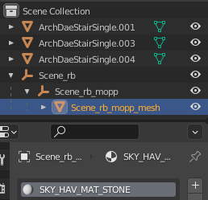

# Skywind Blender Toolkit

This addon is a collection of scripts to assist with modeling for Skywind. Currently it contains three functions:
- Create Collision Mesh
- Create LOD Meshes
- Sync Object/Mesh Names

## Create Collision Mesh

Hotkey: `Ctrl+Alt+C`

Usage instructions:
In object mode, select all the objects you want to be part of your collision mesh. Then press `ctrl+alt+C`. This will merge and decimate the objects, and place them in a hierarchy ready for export via ck-cmd. The name of the material will be the collision material. If your collision mesh needs to have multiple materials, simply create and assign faces to them as needed.

|  | 
|:--:| 
| *Example hierarchy for ck-cmd export* |

There are a few settings you can use to tweak the result.
- Decimation Ratio is self explanatory
- Weld Vertices will attempt to close holes. Some holes may remain
- Weld Distance is the distance between vertices to be welded, if the option is enabled
- Expand Distance is optional, and will scale the mesh faces along their normals, giving a sort of “buffer” around your object.

## Create LOD Meshes

Hotkey: `Ctrl+Alt+L`

**NOTE**: If your initial model has good topology and is not yet triangulated, it may be easier to make these by hand.

Usage Instructions:
Select all the objects you want to be part of your LOD model, then press `ctrl+alt+L`. This will create two LOD models with adjustable decimation ratios. You should still separate each model by material before exporting.

**NOTE**: If your model uses tileable textures and you want it to be atlased (usually you do), you still need to make sure all UVs are in the (0..1) range. That is, no vertices should have UV values less than 0 or greater than 1. This will likely require adjusting UVs.

## Sync Object/Mesh Names

Hotkey: `Ctrl+Alt+N`

Usage Instructions:
Select all the objects you want to have sync names for, then press the hotkey, and all data blocks will be renamed to match their parent objects.
